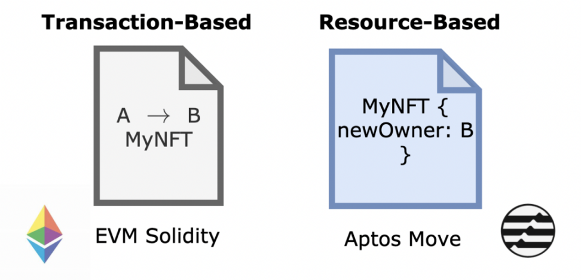
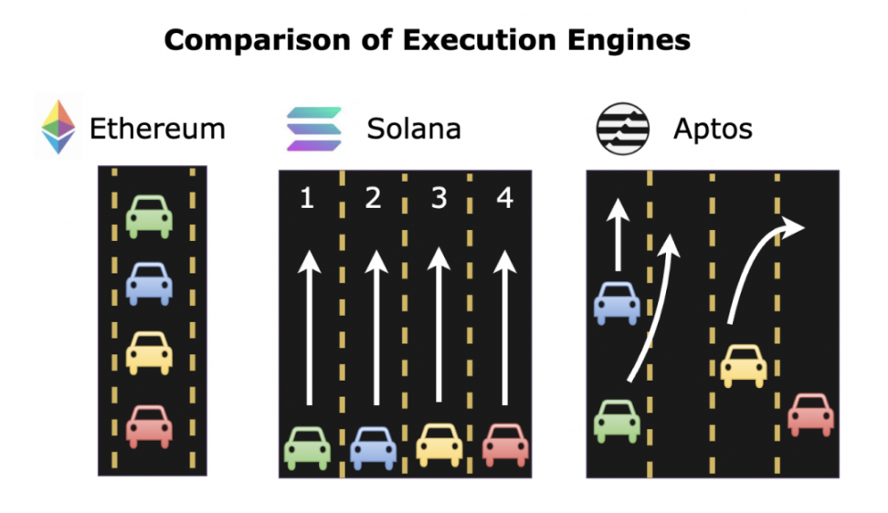

# aptos 

作为 Meta 尝试创建 Libra 加密货币的遗产，Aptos 继承了 Libra 的理想，代表了 Meta 工程师多年来为解决以太坊可扩展性瓶颈而带来的质量不同的范式的努力成果。

共识层和执行层是它的两大核心点。

## 共识层 

AptosBFT 在 HotStuff 之上引入了一些优化，但 HotStuff 的 PoS 设计没有重大的结构变化。

**经典 PBFT 共识算法：**

正常流程 normal case:

更换view leader 的 view change:

**HotStuff 共识算法**

让节点与轮换领导者而不是与所有其他节点进行通信:

合并消息并行流水线化：

## 执行层

Block-STM 并行执行引擎，合约编程语言 Move，实现并行执行。

Move 没有采用基于交易的方法，而是采用基于资源的方法来定义智能合约模型。

资源是原子实体——现有的资源 X 不依赖于任何其他现有的资源，这与事务的情况不同，其中事务 T 依赖于两个先前的代理 A 和 B 的存在。因此，拥有基于资源的方法允许针对并行执行进行优化的更加原子的、独立的结构。

EVM solidity 和 Move Aptos 对比:

Block-STM 并行执行引擎是一个更具原创性的设计，可以说是该项目的主要技术突破。回想一下，资源是原子的——某个资源 X 的易手不依赖于任何其他资源。通过将交易分组（如乐高积木），我们可以在执行资源交易时利用大规模并行性。

执行引擎对比：

