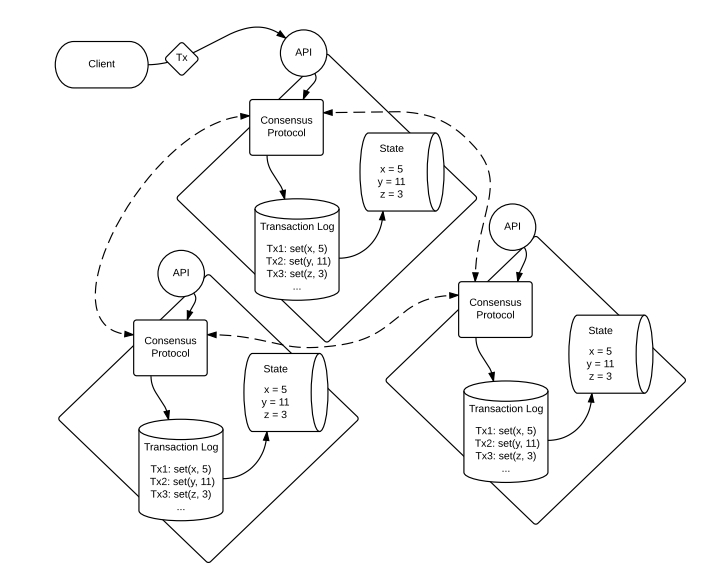
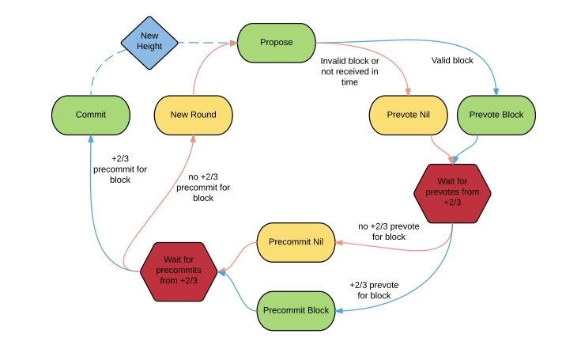
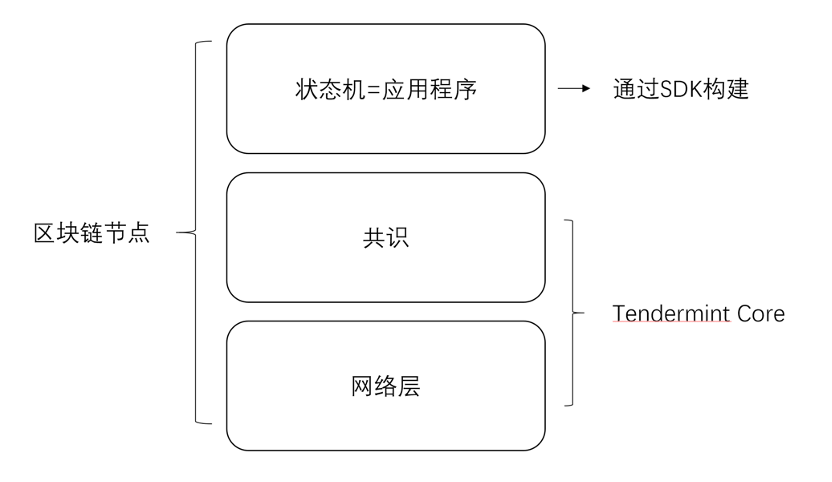
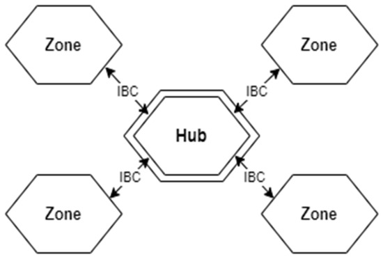
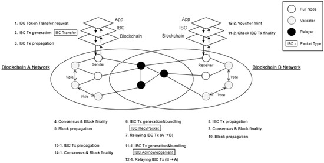
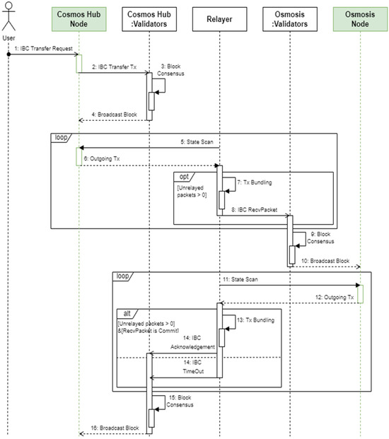

# cosmos

A replicated state machine replicates a transaction log and resulting state across multiple machines.Transactions are received from the
client, run through the consensus protocol, ordered in the transaction log, and executed against the state.




validators only make progress after hearing from two-thirds or more (+2/3) of other validators.



## cosmos SDK

Cosmos SDK中，开发者只需要定义好状态机，那么默认的Tendermint模块就会帮助开发者完成状态机在网络层面的工作.。



1. 解码从Tendermint共识引擎接收到的交易（记住Tendermint只处理[]bytes）
2. 从交易中提取消息并进行基本的合理性检查。
3. 将每条消息路由至对应的模块进行处理。
4. 提交状态变更。

```shell
                              +
                                      |
                                      |  交易通过全节点的 Tendermint 引擎的DeliverTx
                                      |  传递到应用层
                                      |
                                      |
                +---------------------v--------------------------+
                |                    应用（层）                    |
                |                                                |
                |         用 baseapp 的方法: 解码 Tx,              |
                |             提取及路由消息                       |
                |                                                |
                +---------------------+--------------------------+
                                      |
                                      |
                                      |
                                      +---------------------------+
                                                                  |
                                                                  |
                                                                  |
                                                                  |  消息传给相应的模块处理
                                                                  |
                                                                  |
+----------------+  +---------------+  +----------------+  +------v----------+
|                |  |               |  |                |  |                 |
|  AUTH MODULE   |  |  BANK MODULE  |  | STAKING MODULE |  |   GOV MODULE    |
|                |  |               |  |                |  |                 |
|                |  |               |  |                |  | 处理消息, 更改状态 |
|                |  |               |  |                |  |                 |
|                |  |               |  |                |  |                 |
+----------------+  +---------------+  +----------------+  +------+----------+
                                                                  |
                                                                  |
                                                                  |
                                                                  |
                                       +--------------------------+
                                       |
                                       |  返回结果到 Tendermint
                                       | (0=Ok, 1=Err)
                                       v
```

## cosmos ibc

Zones and Hub



flow chart



sequence diagram

